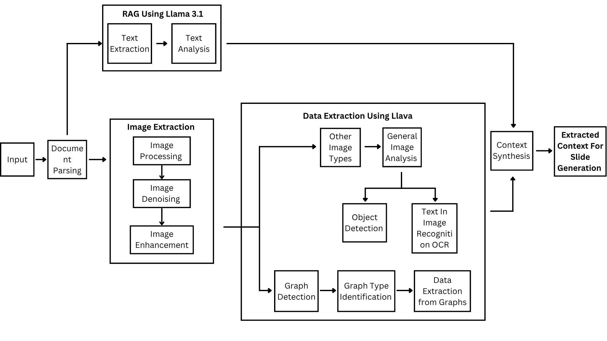

# Automated Slides Generation

Turn a scientific PDF into a clean, presentable PowerPoint deck, entirely on your own machine.
Text is summarised with **Llama 3.1** using retrieval-augmented generation (RAG); figures are analysed with **LLaVA**;
the two branches are merged into one context that drives the slide builder.



## How the code maps to the pipeline

| Pipeline box | Module | What it does |
|---|---|---|
| Input → **Document Parsing** | [`slidegen/parsing.py`](slidegen/parsing.py) | Extracts clean body text (references, citations and URLs removed), the paper title, and every embedded image with its page, `Fig. N` number and caption. Drops logos, blank/black images and duplicates. |
| **RAG using Llama 3.1**: Text Extraction | [`slidegen/text_rag.py`](slidegen/text_rag.py) (`chunk_text`, `DocumentIndex`) | Sentence-aware chunking with overlap, indexed in ChromaDB (keyed by the PDF's content hash). Falls back to BM25 when no embedding model is installed. |
| **RAG using Llama 3.1**: Text Analysis | [`slidegen/text_rag.py`](slidegen/text_rag.py) (`analyze_section`) | For each slide topic: retrieve the most relevant chunks, ask Llama 3.1 for JSON with 3-5 bullets and a speaker-notes paragraph. |
| **Image Extraction**: Processing → Denoising → Enhancement | [`slidegen/image_processing.py`](slidegen/image_processing.py) | Alpha→white, RGB normalisation, resize; non-local-means denoising; CLAHE contrast + unsharp mask. The processed copy is what LLaVA sees; the untouched original goes on the slide. |
| **Data Extraction using LLaVA**: Graph Detection → Graph Type Identification → Data Extraction from Graphs | [`slidegen/image_analysis.py`](slidegen/image_analysis.py) | Three narrow prompts, run only for images detected as graphs. |
| **Data Extraction using LLaVA**: Other Image Types → General Image Analysis → Object Detection + Text-in-Image OCR | [`slidegen/image_analysis.py`](slidegen/image_analysis.py) | Non-graph images get a general description, an object list and an OCR transcript. |
| **Context Synthesis** | [`slidegen/synthesis.py`](slidegen/synthesis.py) | Merges bullets and image analyses into `context.json` and places each figure in the section that discusses it. |
| **Extracted Context for Slide Generation** → slides | [`slidegen/slides.py`](slidegen/slides.py) | Builds a 16:9 `.pptx`: title, overview, one or more slides per section, figures with captions, speaker notes, closing slide. |
| (evaluation) | [`slidegen/evaluation.py`](slidegen/evaluation.py) | ROUGE-1/2/L against the retrieved source text plus a check for numbers that don't appear in the paper. |

`slidegen/pipeline.py` wires the stages together and `slidegen/cli.py` is the command-line entry point.

## Quick start

Requirements: Python 3.10+, [Ollama](https://ollama.com) running locally. A GPU helps but is not required.

```bash
pip install -r requirements.txt
ollama pull llama3.1
ollama pull llava
# optional, enables dense (Chroma) retrieval instead of BM25:
ollama pull nomic-embed-text
```

Generate a deck:

```bash
python -m slidegen run data/samples/Sarcoma.pdf -o outputs/Sarcoma
```

Everything for that run lands in `outputs/Sarcoma/`:

| File | Contents |
|---|---|
| `Sarcoma.pptx` | The presentation |
| `context.json` | The synthesised slide context: edit it by hand if you like, then rebuild with the command below |
| `evaluation.json` | Per-section ROUGE scores and any ungrounded numbers |
| `image_analysis.json` | Everything LLaVA said about each image (audit trail) |
| `images/original`, `images/processed` | Extracted and pre-processed figures |

```bash
python -m slidegen slides outputs/Sarcoma/context.json -o outputs/Sarcoma/Sarcoma.pptx   # rebuild, no models needed
python -m slidegen run paper.pdf --no-images                                              # text-only deck
python -m slidegen run paper.pdf --chart-values                                           # also print LLaVA-read chart values
```

Models and thresholds are configured in [`slidegen/config.py`](slidegen/config.py) and can be overridden with
`SLIDEGEN_TEXT_MODEL`, `SLIDEGEN_VISION_MODEL`, `SLIDEGEN_EMBED_MODEL` and `OLLAMA_HOST`.

## Example results

Both sample papers were run end to end with Llama 3.1 and LLaVA (Ollama, RTX 4050 6 GB; about 10 min for the text branch and
about 1 min per image on the first run, image analyses are cached afterwards).

| Paper | Deck | Slides | Figures placed | ROUGE-1 precision / recall / F1 | Numbers not found in the paper |
|---|---|---|---|---|---|
| Sarcoma classification | [`examples/Sarcoma/Sarcoma.pptx`](examples/Sarcoma/Sarcoma.pptx) ([overview](examples/Sarcoma/overview.png)) | 19 | 7 of 7 | 0.94 / 0.06 / 0.12 | none |
| Stock market intervention analysis | [`examples/Stock_Market/Stock_Market_Prediction.pptx`](examples/Stock_Market/Stock_Market_Prediction.pptx) ([overview](examples/Stock_Market/overview.png)) | 16 | 5 of 5 | 0.93 / 0.06 / 0.12 | none |

How to read the ROUGE numbers: precision is the share of the slide text's words that occur in the source passages the model was given
(0.9+ means the bullets are grounded in the paper). Recall is *meant* to be low, because a 3-bullet slide summarises a few thousand characters of source.
ROUGE only measures overlap, not correctness: an 8B model still occasionally produces an awkward or slightly off bullet (the decks above contain a few), so skim a generated deck before presenting it. Runs are seeded, so the same PDF and models give the same text.

## Design decisions worth knowing

* **LLaVA is treated as a hypothesis, not as ground truth.** A 7B vision model routinely hallucinates chart titles and values
  (on this repo's own Fig. 3 it called a 14-model bar chart a "market share" line chart). Every analysis is cross-checked
  against the caption printed in the PDF; if they share no vocabulary the result is marked `conflict` and only the PDF caption
  is used. LLaVA-read chart values are never shown on slides unless you pass `--chart-values` *and* the analysis is consistent
  with the caption; constant or non-numeric series are discarded.
* **Bullets, not paragraphs.** Llama returns short bullets for the slide and a narrative paragraph that goes into the speaker notes.
* **Figures sit where they belong**: figure type decides eligibility (flowcharts and diagrams → Methodology, graphs → Results / Key Statistics),
  explicit `Fig. N` mentions and keyword overlap rank the candidates, and a figure is never placed on word overlap alone.
  Wide or text-heavy diagrams get their own full-width slide so their labels stay legible.
* **Reproducible artefacts.** `context.json` is the hand-off between the AI stages and the slide builder.
* **Figure type falls back to the caption.** If LLaVA cannot classify an image, words like "approach" or "graph" in the PDF caption decide whether it is treated as a diagram or a graph.
* **Only raster figures are extracted.** Vector graphics embedded in a PDF are not detected. Scanned PDFs (no text layer) are rejected with a clear error.

## Tests

```bash
python -m pytest
```

The suite uses a fake LLM, so it needs neither Ollama nor a GPU. To eyeball a generated deck on Windows with PowerPoint installed:

```bash
powershell -File scripts/render_slides.ps1 outputs/Sarcoma/Sarcoma.pptx outputs/Sarcoma/preview
```

## Repository layout

```
slidegen/            the pipeline package (one module per pipeline stage)
tests/               pytest suite
data/samples/        example input PDFs
examples/            finished decks produced by the pipeline
legacy/              the original notebooks this package replaces (kept for reference)
docs/                pipeline diagram and screenshots
scripts/             developer utilities
```

## What changed from the notebook version

* **Pipeline gaps closed.** The notebooks had no image denoising/enhancement, no graph detection / type identification / data extraction,
  no object detection / OCR split and no context-synthesis step; each is now an explicit stage.
* **Hard-coded values removed.** Every path pointed at `C:\Users\pandl\...`, and the title slide text was typed into the source
  ("Ensemble Methods for High-Performance Classification") and had to be edited for every new PDF. Title and subtitle now come from the PDF.
* **Right-sized decks.** The old decks ran to 34-38 slides of dense paragraphs; the new ones are a focused set of bullet slides with figures.
* **Text bugs fixed.** The sentence splitter broke "Fig. 1" into two bullets; regex clean-ups deleted sentences containing the words "means" or "results";
  `clean_text` flattened every LLM answer into one line; chunk overlap concatenated sentences without a space; retrieved context was cut mid-sentence.
* **Stale index bug fixed.** Chroma collections were named after the PDF *file name*, so a different PDF with the same name silently reused old chunks. They are now keyed by content hash.
* **Evaluation made meaningful.** ROUGE used to compare a 500-character summary with an arbitrary 3000-character window, which capped recall near 0.1 by construction.
  It now compares against the chunks the model actually saw and adds a hallucinated-number check.
* **Repository hygiene.** Removed committed Chroma binaries, intermediate decks and machine-specific caches; added `.gitignore`, `requirements.txt`, tests and a CLI.
